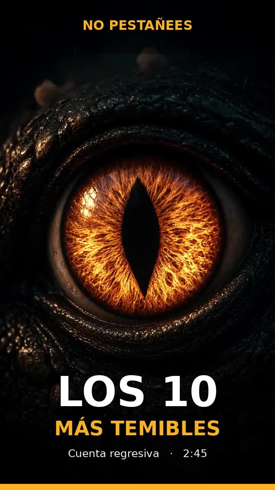

# Los 10 dinosaurios más temibles

Video vertical **9:16** (formato TikTok), **2:45**, animado y narrado en español.

Abre el archivo para reproducirlo:

**[10-dinosaurios-mas-temibles.mp4](10-dinosaurios-mas-temibles.mp4)**

Cuenta regresiva. Cada ficha dura 15 segundos: nombre, rasgo y tamaño.

| # | Dinosaurio | Qué lo hace temible |
|---|------------|---------------------|
| 10 | Allosaurus | Rey del Jurásico. Mordida en hachazo. 8 a 12 m |
| 9 | Carnotaurus | Cuernos, brazos diminutos, el gran depredador más veloz |
| 8 | Therizinosaurus | Herbívoro con garras de casi 1 m |
| 7 | Acrocanthosaurus | 11 m y una cresta de espinas. Norteamérica |
| 6 | Utahraptor | Raptor gigante, hasta 7 m, garra en hoz |
| 5 | Mapusaurus | Fósiles de varios juntos. Caza en grupo a titanosaurios |
| 4 | Carcharodontosaurus | Dientes de tiburón. Cráneo de 1.6 m. África |
| 3 | Giganotosaurus | Más largo que el T. rex. Mordida de sierra. Patagonia |
| 2 | Spinosaurus | El carnívoro más largo. Vela, hocico de cocodrilo, vida en el agua |
| 1 | Tyrannosaurus rex | Mordida de varias toneladas. Visión binocular. Rompe huesos |

Las medidas son estimaciones habituales en la literatura: cambian con cada fósil nuevo. La caza en grupo del Mapusaurus es una hipótesis a partir de un yacimiento con varios individuos, no un hecho cerrado.

Estilo: animación 3D cinematográfica, no metraje real.
